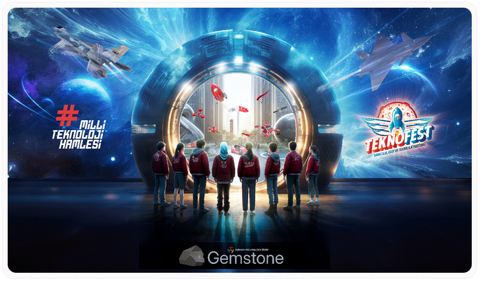

## T3 Foundation Gemstone Project

#### The official GitHub account of the T3 Foundation Gemstone Project.

To see where the projects in the repository are used, you can visit the [Documentation](https://docs.t3gemstone.org/en).

> Gemstone development boards, composed of open-source software and hardware, are artificial intelligence-supported
> devices. They have optimized Real-Time Debian based GNU/Linux operating system which developed for use in
> Teknofest competitions, including Manned and Unmanned Systems, IoT, Robotics, and similar applications.
> 
> These boards are being developed by the [Turkish Technology Team Foundation (T3)](https://t3vakfi.org/en/) for
> competitors, students, and entrepreneurs.
> 
> This documentation contains hardware specifications of the boards, installation guides, system customization
> instructions, rich project examples, advanced ecosystem topics, and information about next-generation technologies.
> 
> For feedback, suggestions, questions, etc., you can visit the [Community Forum](https://community.t3gemstone.org/).